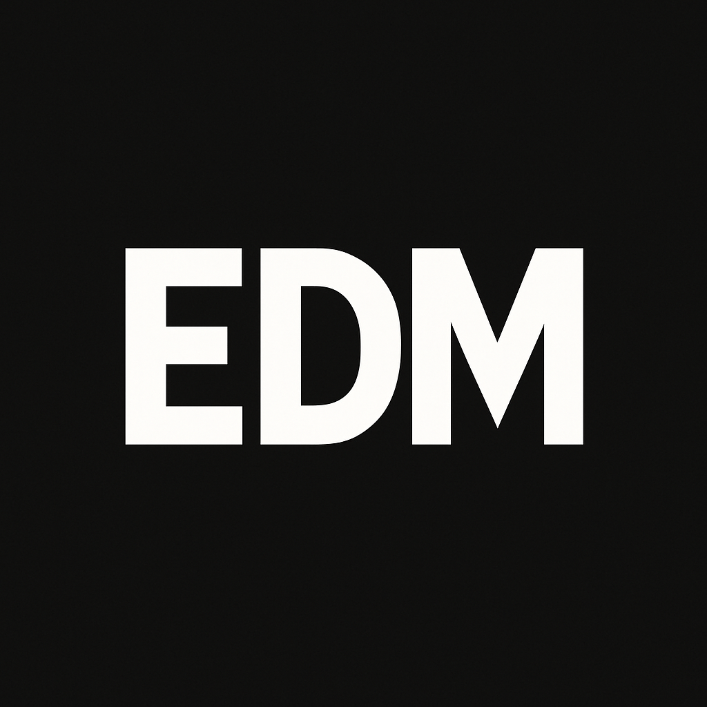

<a name="readme-top">

<br/>

<br />
<div align="center">
  <a href="https://github.com/elijahdelmundo/">
    
  </a>
  <h3 align="center">WD-FINALS Portfolio</h3>
</div>
<div align="center">
  A personal portfolio website showcasing my education, skills, and projects in IT and cybersecurity
</div>

<br />


[](https://wakatime.com/badge/user/018dd99a-4985-4f98-8216-6ca6fe2ce0f8/project/63501637-9a31-42f0-960d-4d0ab47977f8)

---

<br />
<br />

<details>
  <summary>Table of Contents</summary>
  <ol>
    <li>
      <a href="#overview">Overview</a>
      <ol>
        <li>
          <a href="#key-components">Key Components</a>
        </li>
        <li>
          <a href="#technology">Technology</a>
        </li>
      </ol>
    </li>
    <li>
      <a href="#rule,-practices-and-principles">Rules, Practices and Principles</a>
    </li>
    <li>
      <a href="#resources">Resources</a>
    </li>
  </ol>
</details>

---

## Overview

This project is a multi-page personal portfolio website designed to showcase my skills, education, and projects in the field of Information Technology with a focus on cybersecurity. The site features responsive design, clean navigation, and organized sections for about me, education background, project showcase, and contact information.

Guiding Question:
- What is the project: A personal portfolio website for academic and professional presentation
- What's the purpose: To showcase my skills, education, and projects to potential employers or collaborators
- What are key components: About page, Education page, Projects showcase, and Contact form
- What technology used: HTML5, CSS3, and responsive design techniques

### Key Components
- Multi-Page Website with 5 pages (Home, About, Education, Projects, Contact)
- Responsive navigation system
- Project showcase with GitHub repository links
- Contact form and information
- Certification display

### Technology


## Rules, Practices and Principles
1. Always use `WD-` in the front of the Title of the Project for the Subject followed by your custom naming.
2. Do not rename any .html files; always use `index.html` as the filename.
3. Place Files in their respective folders.
4. All file naming are in camel case.
   - Camel case is naming format where there is no white space in separation of each words, the first word is in all lower case while the succeding words first letter are in upper followed by lower cased letters.
   - ex.: buttonAnimatedStyle.css
5. Use only `External CSS`.
6. Renaming of Pages folder names are a must, and relates to what it is doing or data it holding.
7. File Structure to follow below.

```
WD-FINALS
└─ assets
|   └─ img
|       └─ edm.png
|       └─ project1.PNG
|       └─ project2.PNG
|       └─ certiport-logo.png
└─ pages
|  └─ page1 (About)
|     └─ index.html
|     └─ style.css
|  └─ page2 (Education)
|     └─ index.html
|     └─ style.css
|  └─ page3 (Projects)
|     └─ index.html
|     └─ style.css
|  └─ page4 (Contact)
|     └─ index.html
|     └─ style.css
└─ index.html
└─ style.css
└─ readme.md
```

## Resources

| Title | Purpose | Link |
|-|-|-|
| WD-Seatwork-1 | First project showcased in the portfolio | https://github.com/elijahdelmundo/WD-Seatwork-1 |
| WD-Seatwork-2 | Second project showcased in the portfolio | https://github.com/elijahdelmundo/WD-Seatwork-2 |
| Font Awesome | Icons used throughout the website | https://cdnjs.cloudflare.com/ajax/libs/font-awesome/6.0.0/css/all.min.css |
